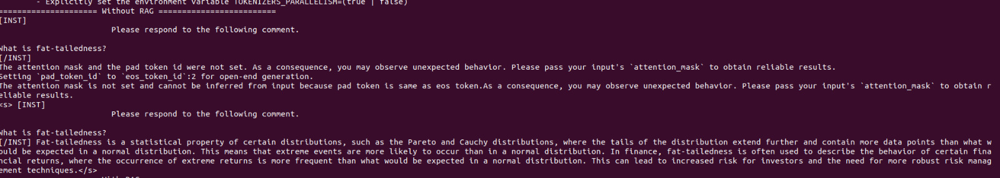
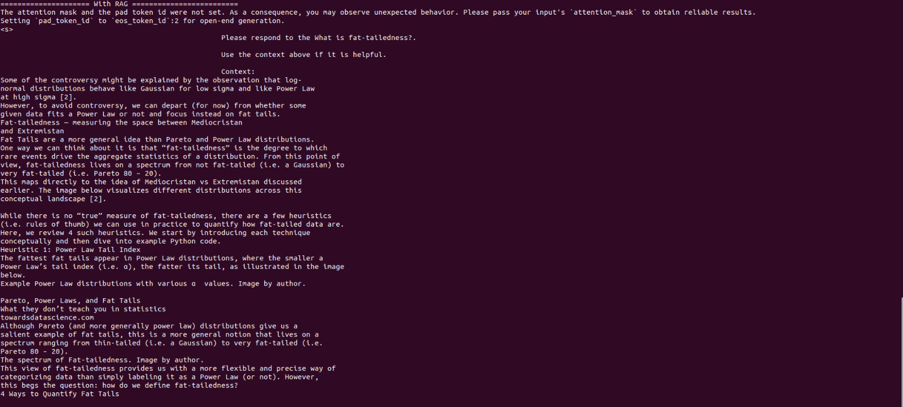
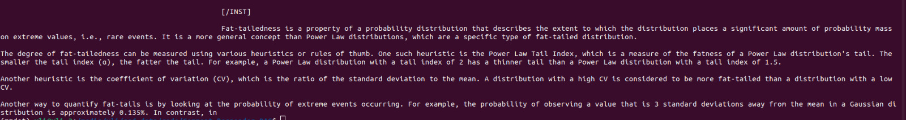

# Mistral_Documents_RAG
This repository contains resources for the Retrieval-Augmented Generation (RAG) model using Mistral. Below is the structure of the repository:

## Repository Structure

```plaintext
.
├── articles
│   ├── medium_CycleGAN.pdf
│   ├── medium_FatTails.pdf
│   ├── medium_GAN.pdf
│   ├── medium_ParetoPowerFatTails.pdf
│   ├── medium_PowerLaws.pdf
│   ├── medium_Transformer.pdf
│   ├── medium_ViT.pdf
│   └── medium_YOLO.pdf
├── images
│   ├── 1.jpeg
│   ├── 2.jpeg
│   └── 3.jpeg
├── mistral_rag.py
└── README.md

2 directories, 13 files
```

## Cloning and Running

Clone the repository using the following command:

``` bash
git clone https://github.com/irfanrah/Mistral_Documents_RAG
```

Run the following command to create and the conda environment using the `environment.yml` file:

```bash
conda env create -f environment.yml
conda activate mmdet
```

Navigate into the directory and run the script:

```bash
cd Mistral_Documents_RAG
python mistral_ragV2.py
```


## Result

### Without RAG


As you can see, the Mistral result is out of scope.

### With RAG



As you can see, the Mistral result is better and represents the document accurately.
